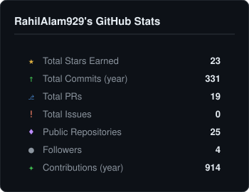
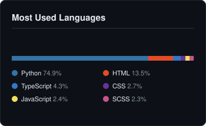

# Hi, I'm MD Rahil

** Software Engineer · AI/ML Enthusiast · Open-Source Contributor**

I build full-stack systems, developer tools, and automation workflows with a focus on backend architecture, code intelligence, and practical ML integration. My work spans REST API design, static analysis tooling, ML pipelines, and CI/CD automation.

---

## Currently Building

- Code intelligence and static analysis platforms
- ML pipelines for real-world classification problems
- Full-stack applications with Next.js and FastAPI
- Reusable GitHub Actions for repository automation
- Open-source developer tools and infrastructure

---

## Tech Stack

**Languages**
`Python` `TypeScript` `JavaScript` `Java`

**Frontend**
`Next.js` `React` `Tailwind CSS`

**Backend**
`FastAPI` `Spring Boot` `Node.js`

**Databases**
`PostgreSQL` `SQLite` `Prisma` `Alembic`

**AI / ML**
`scikit-learn` `Pandas` `NumPy`

**DevOps & Infrastructure**
`Docker` `GitHub Actions` `Bash` `Linux`

---
## Featured Projects

| Project | Description | Stack |
|---|---|---|
| [DevAnalyzeX](https://github.com/RahilAlam929/DevAnalyzeX) | Full-stack platform for repository code quality and security analysis. | `Python` `FastAPI` `Next.js` `PostgreSQL` `Docker` |
| [FraudGuard AI](https://github.com/RahilAlam929/fraudguard-ai) | ML pipeline and API for credit card fraud detection under severe class imbalance. | `Python` `scikit-learn` `FastAPI` `Pandas` |
| [StudentOS](https://github.com/RahilAlam929/StudentOs) | Full-stack platform for academic tracking, projects, internships, and career planning. | `Java` `Spring Boot` `Next.js` `PostgreSQL` `Docker` |
| [BLOGVERSE](https://github.com/RahilAlam929/BLOGVERSE) | Multi-user blogging platform with image uploads and author-scoped content management. | `Next.js` `TypeScript` `Prisma` `PostgreSQL` |
| [RuntimeLens](https://github.com/RahilAlam929/RuntimeLens) | Developer tool for project exploration and automated static code review. | `Next.js` `TypeScript` `Prisma` `SQLite` |
| [repo-health-action](https://github.com/RahilAlam929/repo-health-action) | GitHub Action that evaluates repository health and generates a quality score. | `GitHub Actions` `Bash` `YAML` |

---

## Open Source

| Project | Description |
|---|---|
| [developer-roadmap](https://github.com/nilbuild/developer-roadmap) | Community-maintained developer learning roadmaps — contributed to roadmap content |
| [kana-dojo](https://github.com/lingdojo/kana-dojo) | Japanese learning platform built with Next.js — contributed to content and i18n |
| [open-elements-website](https://github.com/OpenElements/open-elements-website) | OpenElements web presence — contributed to site maintenance and configuration |
| [firstcontributions](https://github.com/firstcontributions/firstcontributions.github.io) | Open-source onboarding platform for first-time contributors |
 [mycelium](https://github.com/mycelium-labs/mycelium) | Python reliability and safety framework — contributed a Contributor Code of Conduct and community documentation |
---

## Engineering Focus

Areas I actively work in and explore:

Full-Stack Engineering · Backend Systems · REST API Design · AI/ML Pipelines · Static Analysis · Code Intelligence · GitHub Automation · CI/CD · Security Fundamentals · Open Source

---

## GitHub Stats

&nbsp;&nbsp;

---

## Connect

&nbsp;

---

Build. Ship. Learn. Contribute.
